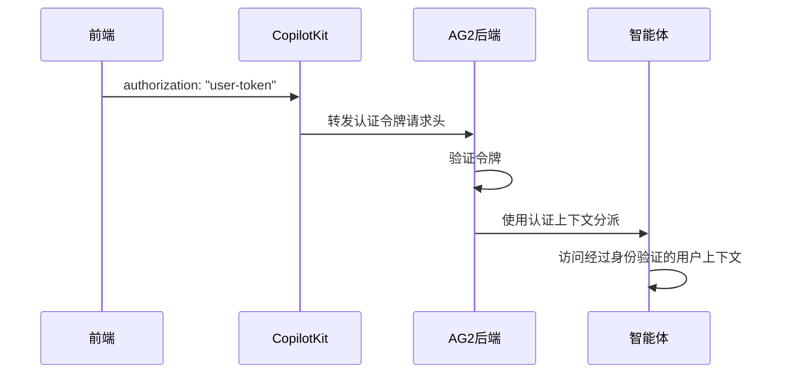

## 概述

CopilotKit 支持两种部署模式下 AG2 后端的用户认证：

- **LangGraph Platform 等效**：托管运行时转发到您的 AG2 `/chat` 端点
- **自托管运行时**：您自己的 CopilotKit 运行时转发到您的 AG2 `/chat` 端点

这两种方法都允许您的 AG2 后端访问经过身份验证的用户上下文并执行授权。

此模式使您的后端能够：

- 在分派智能体之前验证用户令牌
- 将经过身份验证的用户上下文附加到智能体状态/工具
- 在服务器端执行授权决策

<Callout type="info">
  CopilotKit 通过 <code>/chat</code> 消费 AG2 流式传输的 AG-UI 协议事件。请参阅 <a href="https://docs.ag2.ai/latest/docs/user-guide/ag-ui/" target="_blank">AG2 AG-UI 集成文档</a>。
</Callout>

## 工作原理



## 前端设置

通过 `properties` 属性传递您的认证令牌：

```tsx
<CopilotKit
  runtimeUrl="/api/copilotkit"
  properties={{
    authorization: userToken, // 转发到 AG2 /chat
  }}
>
  <YourApp />
</CopilotKit>
```

**注意**：`authorization` 属性将作为请求头转发到您的 AG2 `/chat` 端点。

## LangGraph Platform 部署

**对于托管部署**，使用令牌头验证保护您的 AG2 `/chat` 端点。

### 设置认证处理程序

```python
from fastapi import FastAPI, Header, HTTPException
from fastapi.responses import StreamingResponse
from autogen import ConversableAgent, LLMConfig
from autogen.ag_ui import AGUIStream, RunAgentInput

agent = ConversableAgent(
    name="assistant",
    system_message="You are a helpful assistant.",
    llm_config=LLMConfig({"model": "gpt-5.2-mini"}),
)

stream = AGUIStream(agent)
app = FastAPI()

def validate_your_token(token: str) -> dict:
    # 替换为您自己的验证逻辑。
    if token != "valid-token":
        raise HTTPException(status_code=401, detail="Unauthorized")
    return {"user_id": "user_123", "role": "member"}

@app.post("/chat")
async def run_agent(
    message: RunAgentInput,
    accept: str | None = Header(None),
    authorization: str | None = Header(None),
):
    if not authorization:
        raise HTTPException(status_code=401, detail="Missing authorization header")

    token = authorization.replace("Bearer ", "")
    user_info = validate_your_token(token)

    # 在分派之前使用 user_info 来限定工具、状态和数据访问的范围。
    return StreamingResponse(
        stream.dispatch(message, accept=accept),
        media_type=accept or "text/event-stream",
    )
```

### 在智能体中访问用户

使用经过验证的用户身份来限定工具调用和数据访问的范围：

```python
from typing import Annotated
from autogen import ContextVariables

@agent.register_for_llm(description="Return account data for the authenticated user.")
def get_account_data(
    context: ContextVariables,
    account_id: Annotated[str, "The target account id"],
) -> dict:
    user = context.get("auth_user")
    if not user:
        return {"error": "unauthorized"}
    # 示例检查：确保用户可以访问此账户
    if account_id not in user.get("allowed_accounts", []):
        return {"error": "forbidden"}
    return {"account_id": account_id, "owner": user["user_id"]}
```

## 自托管部署

**对于自托管部署**，在您自己的 FastAPI 服务中使用相同的 `/chat` 请求头验证模式。

### 设置动态智能体配置

```python
from fastapi import FastAPI, Header, HTTPException
from fastapi.responses import StreamingResponse
from autogen import ConversableAgent, LLMConfig
from autogen.ag_ui import AGUIStream, RunAgentInput

agent = ConversableAgent(
    name="assistant",
    system_message="You are a helpful assistant.",
    llm_config=LLMConfig({"model": "gpt-5.2-mini"}),
)

stream = AGUIStream(agent)
app = FastAPI()

@app.post("/chat")
async def run_agent(
    message: RunAgentInput,
    accept: str | None = Header(None),
    authorization: str | None = Header(None),
):
    if not authorization:
        raise HTTPException(status_code=401, detail="Unauthorized")
    # 在此处验证令牌，然后分派
    return StreamingResponse(
        stream.dispatch(message, accept=accept),
        media_type=accept or "text/event-stream",
    )
```

### 在智能体中访问用户

在令牌验证后，将用户身份保留在请求范围的上下文中，并在 AG2 工具/状态读取中执行访问检查。

## 通用认证模式

对于在托管和自托管模式下运行的后端，请使用此模式：

```python
def extract_user_from_auth_header(authorization: str | None) -> dict | None:
    if not authorization:
        return None
    token = authorization.replace("Bearer ", "")
    return validate_your_token(token)
```

然后：

- 在 `/chat` 上读取 `authorization`
- 在 `stream.dispatch(...)` 之前验证令牌
- 附加用于工具/状态授权的用户上下文
- 拒绝未经授权或超出范围的访问

## 安全注意事项

### LangGraph Platform

- **令牌验证**：在您的 AG2 `/chat` 端点上验证令牌
- **用户范围**：按经过身份验证的用户身份限定数据访问范围

### 自托管

- **手动验证**：实施并维护您自己的验证逻辑
- **请求头转发**：确保您的运行时将 `authorization` 转发到 AG2

### 通用最佳实践

- **权限检查**：在 AG2 工具中执行基于角色的检查
- **传输安全**：通过 HTTPS 提供 `/chat` 服务
- **最小权限**：仅返回当前用户/任务所需的数据

## 故障排除

### 常见问题

**令牌未到达后端**：

- 确保您在 `properties` 中传递 `authorization`
- 确认您的运行时将请求头转发到 AG2 `/chat`

**令牌格式无效**：

- 一致地处理原始令牌和 `Bearer <token>` 格式

**意外的匿名访问**：

- 验证在调用 `stream.dispatch(...)` 之前发生 `authorization` 检查

## 下一步

- [使用 AG2 后端配置聊天 UI ->](/ag2/prebuilt-components)
- [了解共享状态 ->](/ag2/shared-state)
- [实现人机协同工作流 ->](/ag2/human-in-the-loop)
