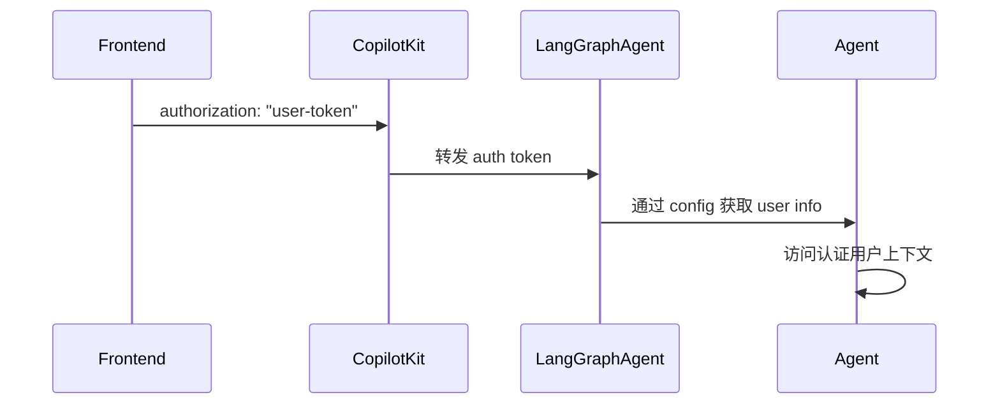

## 概述

CopilotKit 在两种部署模式下支持 LangGraph Agent 的用户认证：

- **LangGraph 平台**：使用 `@auth.authenticate` 装饰器进行内置认证
- **自托管**：使用动态 Agent 配置传递认证上下文

两种方法都使您的 Agent 能够访问认证用户上下文并实现适当的授权。

## 工作原理



## 前端设置

通过 `properties` 属性传递您的认证令牌：

```tsx
<CopilotKit
  runtimeUrl="/api/copilotkit"
  properties={{
    authorization: userToken, // 作为 Bearer token 转发
  }}
>
  <YourApp />
</CopilotKit>
```

**注意**：对于 LangGraph 平台，`authorization` 属性作为 Bearer token 转发。

## LangGraph 平台部署

**对于部署到 LangGraph 平台的 Agent**，认证通过 `@auth.authenticate` 装饰器开箱即用。

### 设置认证处理程序

```python
# auth.py - 在您的 LangGraph 平台部署中
from langgraph_sdk import Auth

auth = Auth()

@auth.authenticate
async def authenticate(authorization: str | None):
    if not authorization or not authorization.startswith("Bearer "):
        raise Auth.exceptions.HTTPException(status_code=401, detail="Unauthorized")

    token = authorization.replace("Bearer ", "")
    user_info = validate_your_token(token)  # 您的验证逻辑

    return {
        "identity": user_info["user_id"],
        "role": user_info.get("role"),
        "permissions": user_info.get("permissions", [])
    }
```

### 在 Agent 中访问用户

```python
async def my_agent_node(state: AgentState, config: RunnableConfig):
    # 从 LangGraph 平台认证访问用户
    user_info = config["configuration"]["langgraph_auth_user"]
    user_id = user_info["identity"]
    user_role = user_info.get("role")

    # 使用用户上下文的 Agent 逻辑
    return state
```

有关完整的实现细节，请参阅 [LangGraph 平台认证文档](https://docs.langchain.com/langsmith/auth#authentication)。

## 自托管部署

**对于自托管的 Agent**，您需要通过动态 Agent 创建手动配置认证上下文。

### 设置动态 Agent 配置

```python
# demo.py - 配置带有认证上下文的 Agent
from copilotkit import CopilotKitRemoteEndpoint, LangGraphAgent

sdk = CopilotKitRemoteEndpoint(
    agents=lambda context: [
        LangGraphAgent(
            name="sample_agent",
            description="支持认证的 Agent",
            graph=graph,
            langgraph_config={
                "configurable": {
                    "copilotkit_auth": context["properties"].get("authorization")
                }
            }
        )
    ],
)
```

### 在 Agent 中访问用户

```python
async def my_agent_node(state: AgentState, config: RunnableConfig):
    # 处理自托管模式的认证
    auth_token = config["configurable"].get("copilotkit_auth")
    if auth_token:
        user_info = validate_your_token(auth_token)
        user_id = user_info["user_id"]
        user_role = user_info.get("role")
    else:
        user_id = "anonymous"
        user_role = None

    # 使用用户上下文的 Agent 逻辑
    return state
```

## 通用认证模式

对于在两种环境中工作的 Agent，请使用此模式：

```python
async def my_agent_node(state: AgentState, config: RunnableConfig):
    user_id = "anonymous"
    user_role = None

    # LangGraph 平台模式
    if "configuration" in config and "langgraph_auth_user" in config["configuration"]:
        user_info = config["configuration"]["langgraph_auth_user"]
        user_id = user_info["identity"]
        user_role = user_info.get("role")

    # 自托管模式
    elif "configurable" in config and "copilotkit_auth" in config["configurable"]:
        auth_token = config["configurable"]["copilotkit_auth"]
        if auth_token:
            user_info = validate_your_token(auth_token)
            user_id = user_info["user_id"]
            user_role = user_info.get("role")

    # 使用用户上下文的 Agent 逻辑
    return state
```

## 安全注意事项

### LangGraph 平台

- **Token 验证**：通过 `@auth.authenticate` 处理程序自动验证
- **内置安全**：LangGraph 平台处理 token 解析和验证
- **用户范围**：使用授权处理程序将资源范围限定为认证用户

### 自托管

- **手动验证**：您必须在 Agent 逻辑中实现 token 验证
- **上下文传递**：通过 Agent 配置传递认证上下文
- **安全责任**：确保适当的 token 验证和用户范围

### 一般最佳实践

- **权限检查**：在您的 Agent 中实现基于角色的访问控制
- **Token 安全**：使用安全的 token 生成和验证
- **用户范围**：始终将数据访问范围限定为认证用户

有关全面的认证模式、授权处理程序和安全最佳实践，请参阅 [LangGraph 平台认证文档](https://docs.langchain.com/langsmith/auth#authentication)。

## 故障排除

### 常见问题

**Token 未到达 Agent**：

- 确保您在 `properties` 属性中传递了 `authorization`
- 对于自托管：验证动态 Agent 配置是否正确设置

**Token 格式无效**：

- CopilotKit 自动为 LangGraph 平台添加 `Bearer ` 前缀
- 对于自托管：在验证逻辑中处理 token 格式

**用户信息不可用**：

- **LangGraph 平台**：验证您的 `@auth.authenticate` 处理程序是否正确配置
- **自托管**：检查 `copilotkit_auth` 是否正确传递在 `langgraph_config` 中

**认证在本地工作但在生产中不工作**：

- 确保您使用正确的部署模式（LangGraph 平台 vs 自托管）
- 验证环境特定的配置差异

## 下一步

- [配置您的 LangGraph 平台部署 →](/langgraph/quickstart)
- [了解 Agent 状态管理 →](/langgraph/shared-state)
- [实现人机协同工作流 →](/langgraph/human-in-the-loop)
