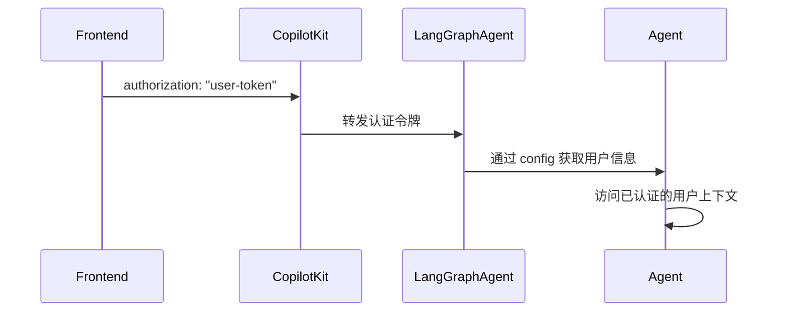

## 概述

CopilotKit 在两种部署模式下支持 LangGraph 智能体的用户身份验证：

- **LangGraph 平台**：使用 `@auth.authenticate` 装饰器内置身份验证
- **自托管**：使用动态智能体配置传递身份验证上下文

两种方法都使您的智能体能够访问经过身份验证的用户上下文并实施适当的授权。

## 工作原理



## 前端设置

通过 `properties` 属性传递您的身份验证令牌：

```tsx
<CopilotKit
  runtimeUrl="/api/copilotkit"
  properties={{
    authorization: userToken, // 作为 Bearer 令牌转发
  }}
>
  <YourApp />
</CopilotKit>
```

**注意**：对于 LangGraph 平台，`authorization` 属性会作为 Bearer 令牌转发。

## LangGraph 平台部署

**对于部署到 LangGraph 平台的智能体**，身份验证可与 `@auth.authenticate` 装饰器开箱即用。

### 设置身份验证处理器

```python
# auth.py 在您的 LangGraph 平台部署中
from langgraph_sdk import Auth

auth = Auth()

@auth.authenticate
async def authenticate(authorization: str | None):
    if not authorization or not authorization.startswith("Bearer "):
        raise Auth.exceptions.HTTPException(status_code=401, detail="未授权")

    token = authorization.replace("Bearer ", "")
    user_info = validate_your_token(token)  # 您的验证逻辑

    return {
        "identity": user_info["user_id"],
        "role": user_info.get("role"),
        "permissions": user_info.get("permissions", [])
    }
```

### 在智能体中访问用户

```python
async def my_agent_node(state: AgentState, config: RunnableConfig):
    # 从 LangGraph 平台身份验证访问用户
    user_info = config["configuration"]["langgraph_auth_user"]
    user_id = user_info["identity"]
    user_role = user_info.get("role")

    # 带有用户上下文的智能体逻辑
    return state
```

有关完整的实现细节，请参阅 [LangGraph 平台身份验证文档](https://docs.langchain.com/langsmith/auth#authentication)。

## 自托管部署

**对于自托管智能体**，您需要通过动态智能体创建手动配置身份验证上下文。

### 设置动态智能体配置

```python
# demo.py - 使用身份验证上下文配置智能体
from copilotkit import CopilotKitRemoteEndpoint, LangGraphAgent

sdk = CopilotKitRemoteEndpoint(
    agents=lambda context: [
        LangGraphAgent(
            name="sample_agent",
            description="支持身份验证的智能体",
            graph=graph,
            langgraph_config={
                "configurable": {
                    "copilotkit_auth": context["properties"].get("authorization")
                }
            }
        )
    ],
)
```

### 在智能体中访问用户

```python
async def my_agent_node(state: AgentState, config: RunnableConfig):
    # 处理自托管模式的身份验证
    auth_token = config["configurable"].get("copilotkit_auth")
    if auth_token:
        user_info = validate_your_token(auth_token)
        user_id = user_info["user_id"]
        user_role = user_info.get("role")
    else:
        user_id = "anonymous"
        user_role = None

    # 带有用户上下文的智能体逻辑
    return state
```

## 通用身份验证模式

对于在两种环境中工作的智能体，使用以下模式：

```python
async def my_agent_node(state: AgentState, config: RunnableConfig):
    user_id = "anonymous"
    user_role = None

    # LangGraph 平台模式
    if "configuration" in config and "langgraph_auth_user" in config["configuration"]:
        user_info = config["configuration"]["langgraph_auth_user"]
        user_id = user_info["identity"]
        user_role = user_info.get("role")

    # 自托管模式
    elif "configurable" in config and "copilotkit_auth" in config["configurable"]:
        auth_token = config["configurable"]["copilotkit_auth"]
        if auth_token:
            user_info = validate_your_token(auth_token)
            user_id = user_info["user_id"]
            user_role = user_info.get("role")

    # 带有用户上下文的智能体逻辑
    return state
```

## 安全注意事项

### LangGraph 平台

- **令牌验证**：通过 `@auth.authenticate` 处理器自动验证
- **内置安全**：LangGraph 平台处理令牌解析和验证
- **用户范围**：使用授权处理器将资源限定给已认证用户

### 自托管

- **手动验证**：您必须在智能体逻辑中实现令牌验证
- **上下文传递**：通过智能体配置传递身份验证上下文
- **安全责任**：确保适当的令牌验证和用户范围

### 通用最佳实践

- **权限检查**：在智能体中实施基于角色的访问控制
- **令牌安全**：使用安全的令牌生成和验证
- **用户范围**：始终将数据访问范围限定给已认证用户

有关全面的身份验证模式、授权处理器和安全最佳实践，请参阅 [LangGraph 平台身份验证文档](https://docs.langchain.com/langsmith/auth#authentication)。

## 故障排除

### 常见问题

**令牌未到达智能体**：

- 确保您在 `properties` 属性中传递了 `authorization`
- 对于自托管：验证动态智能体配置是否正确设置

**令牌格式无效**：

- CopilotKit 会自动为 LangGraph 平台添加 `Bearer ` 前缀
- 对于自托管：在验证逻辑中处理令牌格式

**用户信息不可用**：

- **LangGraph 平台**：验证您的 `@auth.authenticate` 处理器是否配置正确
- **自托管**：检查 `copilotkit_auth` 是否正确传递到了 `langgraph_config`

**身份验证在本地工作但在生产环境中失败**：

- 确保您使用的是正确的部署模式（LangGraph 平台 vs 自托管）
- 验证环境特定的配置差异

## 下一步

- [配置您的 LangGraph 平台部署 →](/langgraph/quickstart)
- [了解智能体状态管理 →](/langgraph/shared-state)
- [实施人机协同工作流程 →](/langgraph/human-in-the-loop)
